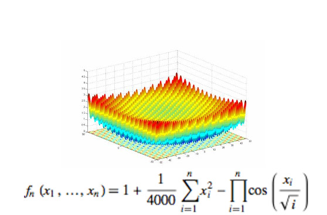
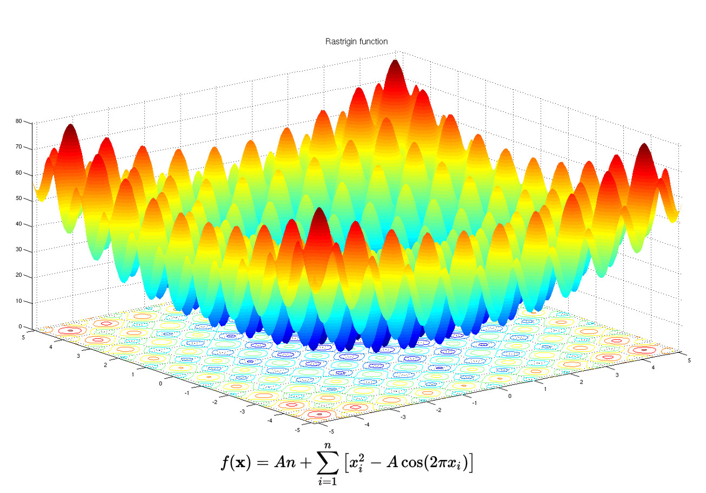

Morcego em GPU
==============

Contextualização
----------------

Aplicar o algoritmo do morcego em GPU.

Separar a população paralelamente (DAO, 2015).

C CUDA 8 na Amazon GRID K520.

Algoritmos em GPU
-----------------

- Sim: Bactérias
- Sim: Busca da harmonia
- Sim: Celular automata
- Sim: Computação de membrana
- Sim: Cuco
- Sim: Formiga
- Sim: Genéticos
- Sim: Partículas
- Sim: Procura por alimentos de abelhas
- Sim: Pulo do Sapo
- Sim: Redes Neurais
- Sim: Vaga-lume 
- Sim: Acasalamento de abelhas
- Sim: Braimstorming process
- Sim: CMAE
- Não: Morcego
- Não: Polinização de Flores NC
- Não: Sistema Imunológico Artificial
- Não: Mosquito
- Não: Tubarão
- Não: Vespa
- Não: Infestação de baratas

Modelagem
---------

- Agente: Morcego
- Medida de desempenho: Maior/menor posição já encontrada no espaço dimensional
- Ambiente: Espaço N dimensional
- Sensores: Som
- Atuadores: Frequência, amplitude de onda
- Observável: Parcial
- Determinístico/estocástico: Estocástico
- Estático ou dinâmico: dinâmico
- Episódico/sequencial: Sequencial
- Discreto ou contínuo: Contínuo
- Multiagente: Sim

Parâmetros
----------

- Alfa: amplitude (probabilidade de valores ruins entrarem),
  0.9,0.5
- Beta: taxa de diminuição da amplitude
- Lambda: taxa de pulsos (probabilidade de busca local) 0.9, 0.1
- População: 40

Variáveis
---------

- Frequência: aleatória (Varia as chances de intensificação e diversificação)
- Taxa de pulso: Aumenta com o tempo (Aumenta as changes de busca local)
- Amplitude: Diminui conforme vai se aproximando de um valor
  ótimo

Regras
------

Conforme o tempo vai passando somente as melhores soluções globais
vão permanecendo e a probabilidade de busca local acontecer vai
aumentando.

Quão mais longe do GBEST maior a velocidade de movimentação.

### Pseudo Código

Os morcegos iniciam em posições aleatórias.

Enquanto o critério de parada não for atingido itera sobre todos
os morcegos.

Para cada morcego
-----------------

- Gera-se uma frequência aleatória
- Gera-se uma velocidade inversamente proporcional a distancia do
gbest utilizando a frequência gerada
- Gera-se a nova posição utilizando a posição atual mais
  velocidade.
- Conforme a taxa de emissão aumenta a probabilidade de fazer
  busca local é maior
- Na busca local pode-se efetuar um random walk considerando a
  média de amplitude dos agentes
- Troca a posição do morcego se a temporária é melhor ou um fator
  estocástico é obedecido
- Atualiza o melhor morcego

Pseudo Código Original
----------------------

Pseudo Código Jelson's
-----------------------

Benchmarks
==========

Funções de Benchmarks
--------------------

- Ackley
- Griewank
- Rastrigin
- Sphere

Ackley
------

Griewank
--------

Rastrigin
--------

Sphere
------

Benchmarks Yang's 2010
----------------------

- Ackley
- De Jong
- Easoms
- Eggcrate
- Griewank
- Michalewicz
- Rastrigin
- Rosenbrocks
- Schewefels
- Schuberts

Benchmarks Jelson's
-------------------

- Ackley
- Griewank
- Rastrigin
- Sphere

Benchmarks Adis
---------------

- Ackley
- Griewank
- Rastrigin
- Rosenbrok
- Sphere

Benchmarks Li
-------------

- Ackley
- Eliptic
- Rastrigin
- Rosenbrocks
- Schwefel
- Sphere

Referências
-----------

 - Bat Algorithm: An Overview and it's Applicaions, S Induja,
International Journal of Advanced Research in Computer and
Communication Engineering, 2016

- A New Metaheuristics Bat-Inspired Algorithm, Xin-She Yang,
Department of Engineering, Cambridge, 2010

- Análise de Sensibilidade dos Parâmetros do Bat Algorithm e
Comparação de Desempenho, Jelson A. Cordeiro, Rafael Stubs
Parpinelli, Heitor Silvério Lopes

- Parallel bat algorithm for optimizing makespan in job scheduling
problems, Thi-Kien Dao, Tien-Szu Pan, Trong-The Nguyen,
Jeng-Shyang Pan,2015, Springer Sience Review

- Improved Hibridized Bat algorithm for Global Numerical
Optimization, Adis Alihodzic, Milan Tuba, 2014, International
Conference on Computer Modeling and simulation

- Benchmark Functions for the CEC'2013 Special Session and
Competition on Large-Scale Global Optimization, Xiaodong Li, Ke
Tang, Mohammad N. Omidvar, Zhenyu Yang, Kai Qin, 2013

