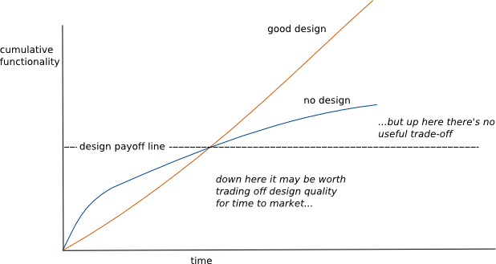

# Mindful Software

## Jean Carlo Machado

---

## Values

- Simplicity
- Readability
- Modular
- Declarative

----

---

## Object Orienting Design

Most software today is very much like an Egyptian pyramid with millions of bricks piled on top of each other, with no structural integrity, but just done by brute force and thousands of slaves

Alan Kay

----

Industry standard OO It's not OO

Data do not perfectly represent a real world object

Data has to be used in many more inter relational ways than OO pretends

When you hide your data behind a class you are force to re implement
basic things that are already available to the language.

---

----

## YAGNI

Last responsible moment

---

---

Abstractions should proceed experience not preceed it

The only patter that should arise from looking at your  source code is patterns
of your domain.

OO is really bad for concurrency

----

## Getting practical

How to minimize the dependency by using callables.
How to use curring as a dependency inejction scheme.

---

Useless comments

----

## References

This is the conundrum at the heart of object decomposition. Every behavior can be re-contextualized by swapping around the subject, verb, and objects. Senders can send messages to Recipients; Messages can send themselves to Recipients; and Recipients can receive messages. - 

